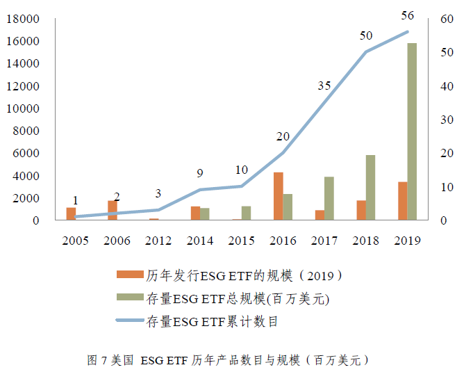

# ESG 投资发展小史

## 时间轴

- **伦理投资**（价值观驱动型）16世纪以来
  - 最早且最为流行的责任投资的形式是筛除或规避投资与个人、团体价值观不一致的公司或行业，例如1971年越南战争期间第一支伦理共同基金，和平女神世界基金（Pax World Fund）为反对核武器制造和军队的投资者提供了选择。
- **早期社会责任投资**（价值驱动型）20世纪60年代至20世纪90年代中期
  - 早期责任投资在以宗教信仰为基础，价值观驱动投资进行筛查方面，与伦理投资并无差异。20世纪60年代起社会责任投资的雏形以一种新概念和投资策略兴起。在这段时期，社会责任投资指的是首先考虑社会责任、伦理和环境行为的价值观导向型或排他性投资。
- **现代社会责任投资**（价值驱动，风险和收益导向）20世纪90年代晚期至今
  - 社会责任投资从伦理转向将环境、社会和公司治理因素纳入到投资决策过程并明确追求投资收益。常用方式包括:伦理负向筛查、环境/社会负向筛查、可持续性/气候变化主题和积极股东主义等等。
  - 1987年，联合国正式提出“可持续发展”的定义。可持续发展指的是一种既能满足我们现今的需求，又不损害子孙后代能满足他们需求的发展模式。进入21世纪，随着这一理念与实践不断推广，金融领域也出现了可持续投资的概念。
- **ESG 投资** 2003年至今
  - 在21世纪早期，产生了一种在包含财务社会和环境因素外，将公司治理纳入到企业社会责任投资中的新趋势。
  - 目前，社会责任投资的主要形式是直接购买社会责任感高的公司的股票或购买具有社会意识的共同基金或交易型开放式指数基金（ETF）
  - 在中国，首只ETF基金「华夏上证50 ETF」于2004年募集成立，迄今仍是国内规模最大的ETF之一。根据Wind数据显示，截至2019年12月31日，共256只ETF成立，规模达到5991亿元，较去年同期规模上涨59%。 

## 数据

- 2021年，根据气候债券市场情报(Climate Bonds Market Intelligence)的数据，截至4月底，欧洲大陆的绿色债券发行量累计超过5000亿美元。这一可喜的消息是在国家和超国家政府加强努力的推动下，该地区出现了几项绿色金融发展。[欧洲在绿色金融上投资达到5000亿美元](https://www.climatebonds.net/2021/05/europe-reaches-500bn-green-investment-climate-bonds-market-intel-reports)：德国国内市场在2021年第一季度超过1000亿美元，达到1080亿美元。德国市场的规模仅次于法国的1370亿美元。荷兰以600亿美元排名第三，瑞典以470亿美元排名第四，西班牙以420亿美元排名第五。根据气候债券市场情报(Climate bonds Market Intelligence)的数据，今年欧洲已经发行了950亿美元的绿色债券。尽管近年来绿色金融取得了不可否认的进步，但全球绿色债务工具的发行仍需加快步伐，为向低碳经济的必要转型提供资金。1月份，气候债券预计2021年将是绿色债券发行量再创新高的一年，预计发行量将达到4500亿美元。
- 2018年初，欧洲、美国、日本、加拿大、澳大利亚与新西兰五大发达市场的可持续投资资产规模已经突破30万亿美元大关，较2016年的水平上升34% （“Global Sustainable Investment Review (2012)", GSIA）
- 根据全球可持续投资联盟（GSIA）最新报告，2018年使用正面清单筛选，负面清单筛选和原则筛选三种形式管理的**资产总规模达25.25万亿美元**，和哈佛大学肯尼迪研究中心2018年发布的报告所估计的**全球社会责任投资规模26万亿美元**接近，其中美国社会责任投资金额为12万亿美元，约占全美专业资产管理总额的25%。（“Money,Millennials and Human Rights — Sustaining ‘Sustainable Investing’”, June 2018, Working Paper No.69, Corporate Social Responsibility Initiative, Harvard Kennedy School）
- 根据全球可持续投资联盟的报告，**2018年采取ESG整合策略的投资规模为17.5万亿美元** （“中国责任投资年度报告（2019）”，中国责任投资论坛）
- 截至2019年11月底，中国共有社会责任投资主题基金95只，最新一期基金资产净值总规模约500亿元人民币。
- 2017年，全球最大的养老基金——日本政府养老投资基金（GPIF）将ESG纳入三大重要投资战略，并以MSCI 
  ESG领先、女权及富时Blossom日本三条ESG指数为标的，被动投资规模约89亿美元，2018年又以S&P日本碳效、全球碳效指数为标的投资100亿美元。近年来GPIF不断提升ESG投资规模，2019年报披露已达290亿美元，在GPIF资产占比10%。
- 根据美国投资公司协会(Investment Company Institute )数据，截至2019年底，美国 ETF共2343只，总规模约4.25万亿美元，美国的ETF体量占世界规模的72%。贝莱德（BlackRock旗下iShare，39%）、先锋（Vanguard，26%）、道富（State Street，16%）三巨头分享了全市场 81%的份额。 
- 截至2020年6月30日，全市场ESG主题公募基金总规模为148.8亿元，包含13只产品。兴全社会责任混合作为最早的ESG主题公募基金，以61.31亿元的基金规模位居首位。超过10亿人民币规模的ESG主题公募基金有兴全社会责任混合、汇添富社会责任混合、南方ESG股票A、博时中证可持续发展100ETF、大摩ESG量化混合，均由大型公募基金发行。 
- 晨星：[2020年二季度，欧洲可持续基金创纪录地吸引了546亿欧元的资金流入；是一季度市场动荡情形下的两倍](https://mp.weixin.qq.com/s/l6mGrh5ory7rDK3MGgozSw)。

来源：《[ESG投资发展报告（2019）](/about/ESG-investment-development-report-2019.pdf)》

## 其他

根据中证指数公司的《[ESG投资发展报告（2019）](/about/ESG-investment-development-report-2019.pdf)》：

- 全球ESG研究提供商已经超过150多家。这些机构中不仅包括ESG数据提供商、特定数据提供商，还包括全球数据商（彭博、路透）、指数供应商（MSCI、FTSE Russell）
- 研究发现ESG表现优异的公司在ROE、分红更具优势、同时未来系统性风险与过去滚动尾部风险更低。而最终在收益上，ESG评分最好的组表现明显高于最差的组，收益风险传导机制顺畅，ESG投资价值显现。

————

- 2020年3月，麦肯锡公司发布一份名为「ESG溢价：价值与绩效的新视角」的研究报告，指出当下市场中，「E」（环境）与「S」（社会）项目的长期价值，已经与「G」（治理）项目的价值不相上下，甚至超越后者，企业高管与投资专业人士对于ESG项目能够创造短期或长期价值，已基本形成共识，报告数据显示，83％的高管与投资专业人士大多表现出其愿意以大约10％的溢价来收购一家在ESG方面拥有积极记录的公司，认为ESG项目将在未来5年中贡献更多的股东价值。这在一定程度说明越来越多的投资者与高管认同ESG表现与企业整体管理水平相关，并将ESG纳入他们的财务及战略决策。目前，超过七成的受访者表示，在进行竞争对手的对标研究以及评估潜在资本项目时，他们会将ESG因素纳入考量。

来源：

1. https://www.cecepec.com/News/info/id/257.html
2. https://www.casvi.org/h-nd-904.html