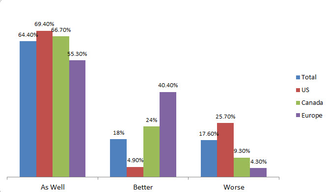

“ESG integration” is defined as including environmental, social and  governance (ESG) factors as a component of fundamental analysis to  identify potential sources of alpha or risk reduction.

[via]( https://www.rbcgam.com/en/ca/article/the-future-of-esg-integration/detail) 

## Responsible investment

Responsible investment (RI) now represents 26% of all professionally  managed assets globally with USD23 trillion of assets managed under RI  strategies. These strategies include ESG integration, engagement, screening, sustainability-themed investing and impact investing1 . The focus of this piece will be ESG integration – a responsible  investment strategy that has grown globally by 38% from USD​7.5 billion  managed in 2014 to USD​10.4 billion in 2016.

[^1]: Global Sustainable Investment Alliance, “Global Sustainable Investment Review 2016.”

## The prevalence of ESG integration

RBC Global Asset  Management released its global ESG survey at the end of October 2017.  The survey sought to better understand the views of institutional asset  owners and investment consultants in Canada, Europe and the United  States on the role that ESG considerations play in portfolio management. The survey revealed that, while RI has moved into the mainstream, a  number of questions and contrasting opinions surrounding ESG integration persist.

In the survey, 67% of respondents said they use ESG  principles as part of their investment approach and decision making. In  Europe, 85% of respondents say they integrate ESG principles. The United States and Canada fall behind, with 49% and 73%, respectively.

What is driving this ESG integration (or lack thereof)? The top three  drivers as identified by respondents that use ESG principles in decision making are: multiple factors used in investment decision process and  not just financial factors (57%); clear value proposition (higher  risk/return profile; 37%); and mandates from boards and other  stakeholders (36%).

Institutions that do not incorporate ESG principles into their  analysis provided the following reasons: no demand from a board or  stakeholders (52%); unclear value proposition (risk/ return profile;  40%); and only financial factors are used in investment decision process (35%). There is a clear gap between institutions that incorporate ESG  principles and institutions that do not, as the debate continues whether incorporating ESG principles results in alpha generation.

## Driving alpha and reducing risk

There is a significant divergence of opinions between Europe/ Canada and the  United States on using ESG analysis as a source of alpha and/or risk  mitigation. In Europe and Canada, 77% and 68% of respondents,  respectively, consider ESG integration to be a risk mitigator, compared  with only 28% of respondents from the United States. What might cause  these diverging views? Perhaps the U.S. respondents do not consider ESG  risks to be material or perhaps there are differences in cultural or  regulatory environments. Without knowing the specific cause for the  divergence, it is clear that there are inconsistent opinions on the  effectiveness of ESG analysis as it relates to identifying and managing  portfolio risk.

Considering the integration of ESG factors as an  alpha source, the divide shifts to one between Europe and North America. In Canada and the United States, 21% and 17% of respondents,  respectively, think of ESG factors as an alpha source, compared with 51% of respondents from Europe. In the United States and Canada, 59% and  37% of respondents, respectively, do not think of ESG factors as an  alpha source, leaving a considerable percentage of the United States and Canada unsure about ESG factors as a source of alpha.

Overall,  there is evidence that using ESG analysis to mitigate risk and/or drive  alpha has become mainstream in Europe, but is still evolving in North  America, especially in the United States.

## ESG integration and returns

Asset managers increasingly believe that integrating ESG analysis into the  investment process will have a material impact on investment risk and/or returns. However, the survey revealed that institutional investors have a persistent fear that a non-financial investment factor will lead to  lower returns.

The survey highlights another significant divide  regarding the impact of ESG integration on performance and, again, U.S.  respondents are skeptical about the issue. Only 5% of respondents  answered definitively that they believe ESG investments are likely to  perform better than non-ESG investments, while 26% of respondents  believe that ESG investments will perform worse.

Source: RBC Global Asset Management Inc.

On the other hand, 82% of all respondents believe that ESG investments are likely to perform as well or better than non-ESG investments.  Additionally, 67% of all respondents expect that companies with  high-quality ESG practices will see improved metrics that relate to  sustainable long-term returns

The issue of performance as it  relates to ESG investments is polarizing. The survey highlights that,  particularly in the United States, a significant percentage of  respondents struggle with accepting that ESG integration can lead to  improved investment performance while another significant percentage of  respondents consider it to be a non-issue. This presents an opportunity  to educate investors on performance of ESG investments and to dismantle  the myth that considering ESG factors means that investors have to  sacrifice returns.

## Momentum of ESG integration

Where is ESG integration headed? Adoption of ESG investing appears to be  growing as 25% of respondents said over the next year they plan to  increase their allocation to managers that incorporate ESG factors into  their investment management process or ESG-based investment strategies.

What has the potential to impede the growth of ESG integration? A majority  of investors who employ ESG criteria across all regions are dissatisfied with the quality of reporting from issuers. Additionally, there is no  consensus on who should be driving the industry toward better reporting  practices. In the United States and Canada, 43% and 38% of respondents,  respectively, said that shareholders should take the lead through proxy  ballot initiatives, while in Europe, 43% of respondents said government  regulators should take the lead.

Another trend that might impact  the momentum of ESG integration is the shift in investor demographics.  The survey reveals that lack of demand explains why some respondents  have not opted to integrate ESG analysis into their decisionmaking  process. However, millennial investors view the management of ESG risks  and opportunities as crucial to the long-term performance of their  portfolios.2 As the intergenerational transfer of wealth to  millennials gathers momentum over the coming years, we expect to see an  increase in demand for ESG integrated strategies.

Europe is a  clear leader in ESG integration. One major factor contributing to the  lag in North America is uncertainty surrounding the performance of ESG  investments. Amid uncertainties and a lack of consensus on key issues,  plans to increase allocations to ESG strategies over the short term  indicate an increase in the rate of global adoption. To keep this  momentum going, there is a clear need for education on the topic of RI  with a focus on the value proposition of ESG integration.

​						1. Global Sustainable Investment Alliance, “Global Sustainable Investment Review 2016.” 2. Morgan Stanley Institute for Sustainable Investing, “Sustainable Signals: The Individual Investor Perspective.” 				