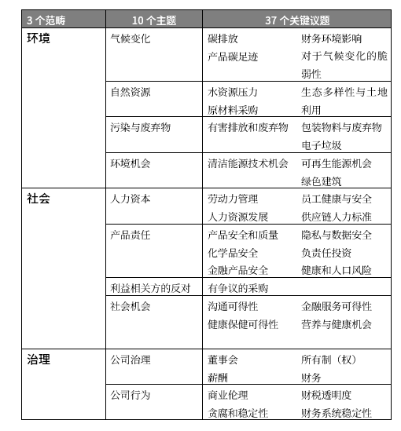
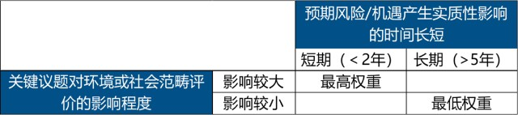
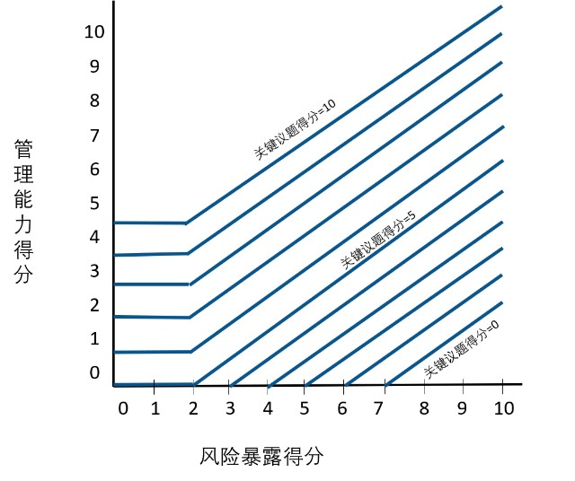
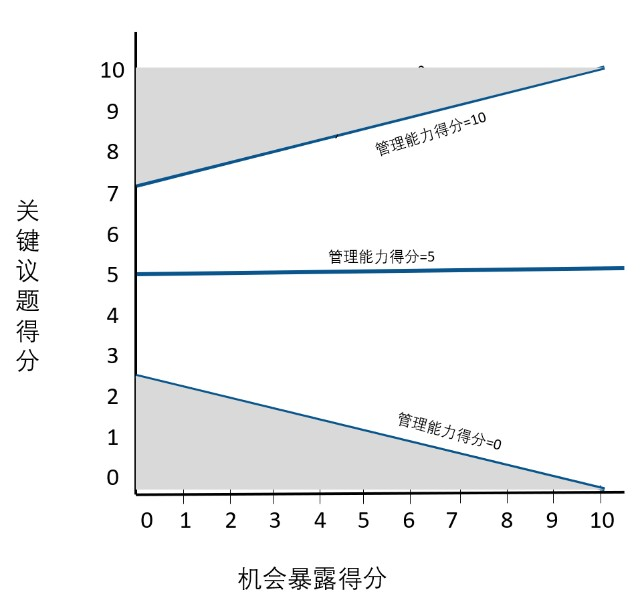
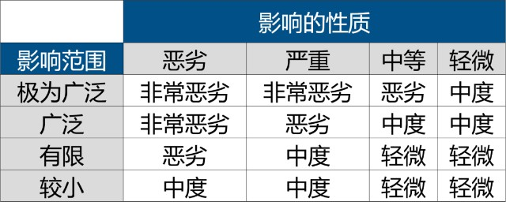
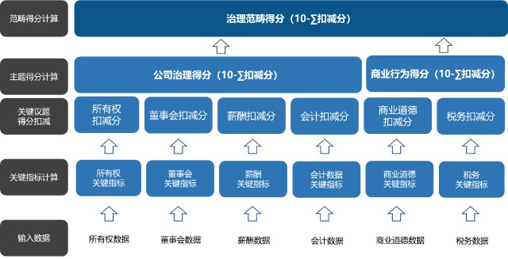
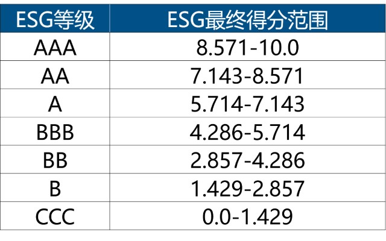

# MSCI ESG 评级方法学（简译）

本文来自[ MSCI ESG RATINGS METHODOLOGY](https://www.msci.com/documents/1296102/21901542/MSCI+ESG+Ratings+Methodology+-+Exec+Summary+Nov+2020.pdf) （[2020年11月版](/apply/MSCI-ESG-Ratings-Methodology-Nov-2020.pdf)）的简单翻译（简译），仅供参考。版权归 MSCI 所有，本文作学习之用。

本文更新：2021年6月4日

## 1.ESG评级的目的

MSCI建立ESG评级体系，是为了衡量发行人应对**与财务相关的长期环境、社会及公司治理（ESG）风险的应变能力，帮助投资者了解其投资组合的ESG风险和机遇**。

按照MSCI的介绍，其ESG评级体系旨在为投资者解答有关公司的四个关键问题：

1. 公司及其所在行业面临的重大ESG风险和机遇是什么？ 
2. 公司如何管理这些风险和/或机会？ 
3. 公司管理主要风险和机遇的情况如何？ 
4. 公司的总体ESG管理情况如何？与全球同业企业相比如何？

## 2.指标框架

MSCI通过定量模型确定了每个行业的重大风险和机遇，并构建了一套指标框架。

该指标体系主要由3大范畴（Pillars）、10项主题（Themes）、35个ESG关键议题（ESG Key Issues）和上百项指标组成。

表：MSCI ESG评级指标框架（2020年11月更新）

## 3.权重

MSCI采用的是**全球行业分类标准（GICS）**，其中包括158个子行业（Sub-Industry）。MSCI会为每项ESG关键议题设置权重，权重范围被设定在5-30%之间。

权重高低的分配主要考察两个方面：一方面是该指标对子行业的影响程度，另一方面是可能受影响的时间长度。在不同类型的子行业中，MSCI为每项关键议题分配了“高”“中”或“低”的影响程度，以及“短期”“中期”“长期”的影响时间。

在最新修订中，MSCI决定从2020年11月开始，**所有子行业的“公司治理”主题按照“高影响、长期”的标准、“商业行为”主题按照“中影响、中期”的标准分配权重。**此外，治理范畴的总权重将降低至最小值33%。

不过，这些指标的权重也不是恒定的。每年11月，MSCI ESG研究团队都会对各个行业的指标项及权重进行一次审查，并做必要的调整。

## 4.评分

环境和社会关键议题对公司来说，有些属于风险，有些可能是机遇。根据不同类型的指标。MSCI也设置了不同的评分方式。

### 风险项指标

对于风险项指标，MSCI不仅衡量公司在该关键议题上的管理策略，同时评估其承受的风险程度。因此，为了取得关键议题上的良好评分，公司需要采取与风险敞口相匹配的管理措施。

例如，同为电力生产的两家公司，或多或少都面临与水资源相关的风险。但如果一家公司处于水资源更为匮乏的地区，其所需要采取的措施应更为广泛，才可能与另外一家公司获得相同的得分。

换句话说，处于水资源丰富地区的公司，即使与另外一家公司采取相同的管理措施，也会在水资源这个指标上得到更高分数。

根据这样的逻辑，MSCI会对每家公司的风险指标进行风险暴露程度（Exposure）和风险管理能力的量化评估。

风险暴露程度是如何量化的呢？某项关键指标对同一行业的不同公司来说，风险暴露程度通常不尽相同。

因此，MSCI把公司业务拆为核心产品、业务属性及性质、经营所在地、外包情况和对政府合作的依赖性等内容。

最终，**这些风险暴露程度被量化为0-10分的打分结果**：0分代表完全无风险，10分代表公司面临非常高的风险。

风险管理能力的量化评估也采用0-10分的打分方式：0分代表公司并未显现出任何的管理能力，或者管理政策未显示出任何效果；10 分代表公司具有非常强的管理能力。

在此基础上，近三年发生的争议事件（Controversies）会导致相应管理能力分数的扣减。

确定了风险暴露程度和风险管理能力的得分，MSCI会按照下图中的标准给风险项指标进行赋分。

例如，当公司面临较高风险暴露（7分）及具备较差风险管理能力（0分）时，最终风险项指标得分为0分；当公司面临较低风险暴露（2 分）且具备较差风险管理能力（0分）时，最终风险项得分为5分；而当公司面临低风险暴露（2分）而具备最高风险管理能力（5分）时，最终风险项评分为满分10分。

### 机遇项指标

机遇项指标的机制与风险项指标类似。MSCI会衡量该公司基于其地理位置及业务类别所面临的机遇大小，以及该公司是否具备能够准确抓住并合理运用该项机遇的能力。但最终的评分标准与风险项略有不同。

当公司面临相同程度的机遇时，具备卓越管理能力的公司将指向更高的机会项得分，采用一般管理能力的公司指向一般的机会项得分，而采取较差管理能力的公司将导致公司较低的机会项得分。机会项的评价也同样采用0-10 分的打分方法。

### 争议事件（Controversies）

争议事件是指可能对公司ESG产生负面影响的单个案例或持续性事件。典型的争议事件包括气体泄露事故、监管机构采取的相关行动、针对同一设施的多项健康或安全性罚款、针对同一产品线的多项反竞争行为指控、多个社区对于同一家公司所在地的抗议等。

争议事件表明公司的风险管理能力存在结构性问题。MSCI认为，争议事件预示着该公司在未来可能产生重大经营风险，理应对公司目前的风险管理能力得分进行扣减。

争议事件又如何量化呢？MSCI根据争议事件对环境或社会造成负面影响的严重程度进行评价，同时考察其影响大小及影响范围，并最终评价为“非常恶劣”“恶劣”“中度”或“轻微”四个等级。

### 治理范畴评分

MSCI认为，基于治理议题的重要性，所有公司都需要考察公司治理的情况。不同行业的公司在治理范畴的关键议题上具有相同的权重。

因此，MSCI采用了“10分倒扣制”的方法来评估公司在公司治理（所有权、薪酬、董事会、会计）和商业行为（商业道德、税务透明）方面的情况，即通过评估公司在治理指标表现，进而从满分10分中减去相应的分数，最终得到该议题的得分。

## 5.得分

MSCI ESG的最终评级结果与所处行业有关。根据环境和社会风险对不同行业的影响程度和影响时长，MSCI为每个GICS子行业设置了环境和社会范畴的关键问题权重；治理议题始终是重要的，会对所有公司得分进行加权和分析。

因此，公司最终ESG得分是由35项关键指标加权计算后，得到10个主题的评分，然后再通过加权评分得到最初的ESG得分，最后还要根据上述行业权重进行调整。

**也就是说，公司最终的ESG评级得分并不是一项绝对的分数，而是公司相对于同业表现的相对成绩。**

公司行业调整后的得分（Final Industry Adjusted Score）按照分值区间最终对应于最佳（AAA）和最差（CCC）之间的七个序列。

## 6.数据来源和反馈

ESG数据主要来源包括：

- 学术，政府，非政府组织数据库（例如透明国际、世界银行）的细分领域或地理范围的宏观数据； 
- 公司披露（财务报告，可持续发展报告，公告）； 
- 政府数据库、1,600多家媒体以及其他与特定公司有关的利益相关方资源。

MSCI虽然是从公开渠道获得发行人的ESG数据，也不会进行特定的问卷调查，但仍然保持与公司的沟通，包括为公司建立可供访问并审查其ESG数据的渠道、在年度ESG评级更新前后给公司发送邮件通知等。

MSCI也欢迎相关公司在年度ESG评级审核过程中提出异议并提供真实的资料补充，以此进行合理的信息更新。

为尽可能获得客观、准确的ESG评估，建议被纳入MSCI指数的公司采取以下行动：

- 建立与MSCI的沟通，审查其已有的ESG数据，并提供实质性的补充资料； 
- 基于MSCI ESG指标框架，分析公司及所处行业的重大ESG风险点，制定切实实可行的管控计划； 
- 强化公司ESG信息的传播，特别是有关ESG风险的系统化管理机制及绩效水水平数据； 
- 保持对MSCI ESG评级的持续关注，深入理解ESG关键议题所指代的内容。

