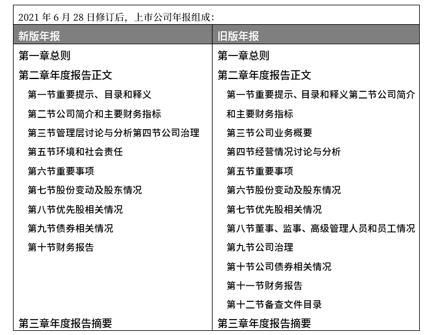

# ESG 在中国

在中国内地，并没有统一的、明确的ESG标准或披露制度。

## 时间线

- 2003年《关于企业环境信息公开的公告》
- 2006和2008年交易所指引
- 2015年《环境保护法》
- 2016年《关于构建绿色金融体系的指导意见》
- 2017年证监会修订定期报告披露要求
- 2018年证监会修订《上市公司治理准则》
- 2021年《企业环境信息依法披露管理办法》
- 2022年《企业环境信息依法披露格式准则》

## 政策演变

- 2002.01   证监会   《上市公司治理准则》   对上市公司治理信息的披露范围做出了明确规定  

- 2007.04   国家环境保护总局   《环境信息公开办法（试行）》 鼓励企业自愿通过媒体、互联网或者企业年度环境报告的方式公开相关环境信息

- 2007.12   国资委   《关于中央企业履行社会责任的指导意见》 将建立社会责任报告制度纳入中央企业履行社会责任的主要内容

- 2008.02   国家环境保护总局  《关于加强上市公司环境保护监督管理工作的指导意见》 环保总局与中国证监会建立和完善上市公司环境监管的协调与信息通报机制，促进上市公司特别是重污染行业的上市公司真实、准确、完整、及时地披露相关环境信息

- 2010.09   环境保护部   《上市公司环境信息披露指南（征求意见稿）》 规范了上市公司披露年度环境报告以及临时环境报告信息披露的时间与范围

- 2017.12   证监会   《第17 号公告》和《第18号公告》鼓励公司结合行业特点，主动披露积极履行社会责任的工作情况；属于环境保护部门公布的重点排污单位的公司或其重要子公司，应当根据法律、法规及部门规章的规定披露主要环境信息

- 2018.09   证监会   《上市公司治理准则》修订   增加了利益相关者、环境保护与社会责任章节，规定了上市公司应当依照法律法规和有关部门要求披露环境信息（E）、履行扶贫等社会责任（S）以及公司治理相关信息（G）
  
  - 在修订说明中，证监会提到“积极借鉴国际经验，推动机构投资者参与公司治理，强化董事会审计委员会作用，确立环境、社会责任和公司治理（ESG）信息披露的基本框架。”（[来源](http://www.csrc.gov.cn/pub/newsite/ssgsjgb/ssszdt/201901/t20190115_349835.html)）
  
- 2021.05.07，证监会就《公开发行证券的公司信息披露内容与格式准则第2号—年度报告的内容与格式（征求意见稿）》《公开发行证券的公司信息披露内容与格式准则第3号—半年度报告的内容与格式（征求意见稿）》公开征求意见。（[新闻来源](http://www.csrc.gov.cn/pub/newsite/zjhxwfb/xwdd/202105/t20210507_397137.html)）

- 2021.06.28，中国证监会网站发布修订后的上市公司年度报告和半年度报告格式准则。本次修改总体保持了原有框架结构。重要变化之一，是将与环境保护、社会责任有关内容统一整合至“第五节环境和社会责任”。在旧版中，这些内容主要集中在“第五节重要事项”，修订之后，重要事项变为第六节。原来放在第九节的公司治理，前移到第四节。**新版第五节环境与社会责任包括三条具体要求**。分别是：
  
  - 第四十一条 属于环境保护部门公布的重点排污单位的公司或其主要子公司，应当根据法律、行政法规、部门规章及规范性文件的规定披露以下主要环境信息:(一)排污信息。包括但不限于主要污染物及特征污染物的名称、排放方式、排放口数量和分布情况、排放浓度和总量、超标排放情况、执行的污染物排放标准、核定的排放总量。(二)防治污染设施的建设和运行情况。(三)建设项目环境影响评价及其他环境保护行政许可情况。(四)突发环境事件应急预案。(五)环境自行监测方案。(六)报告期内因环境问题受到行政处罚的情况。(七)其他应当公开的环境信息。
  - 重点排污单位之外的公司应当披露报告期内因环境问题受到行政处罚的情况，并可以参照上述要求披露其他环境信息，若不披露其他环境信息，应当充分说明原因。
  - 鼓励公司自愿披露有利于保护生态、防治污染、履行环境责任的相关信息。环境信息核查机构、鉴证机构、评价机构、指数公司等第三方机构对公司环境信息存在核查、鉴定、评价的，鼓励公司披露相关信息。
  - 鼓励公司自愿披露在报告期内为减少其碳排放所采取的措施及效果。
  - 第四十二条 鼓励公司结合行业特点，主动披露积极履行社会责任的工作情况，包括但不限于:公司履行社会责任的宗旨和理念，股东和债权人权益保护、职工权益保护、供应商、客户和消费者权益保护、环境保护与可持续发展、公共关系、社会公益事业等方面情况。公司已披露社会责任报告全文的，仅需提供相关的查询索引。
  - 第四十三条 鼓励公司积极披露报告期内巩固拓展脱贫攻坚成果、乡村振兴等工作具体情况。
  
  

- 2022年3月10日，[国务院国资委成立科技创新局及社会责任局](http://www.sasac.gov.cn/n2588025/n2643314/c23711009/content.html)，指导推动企业积极践行ESG理念，主动适应、引领国际规则标准制定，更好推动可持续发展。

## 具体部门政策

### 环境监管部门

- 《环境信息公开办法（试行）》强制超标、超总量排污的企业公开披露环境信息；
- 《关于加强上市公司环境保护监督管理工作的指导意见》指出，积极探索建立上市公司环境信息披露机制；
- 《企业事业单位环境信息公开办法》规定，重点排污单位应当公开指定环境信息。
- 于2015年实施的新《环境保护法》明确了“重点排污单位”在环境信息公开方面的责任。
- 2017年，根据中国人民银行牵头，联合财政部、发改委及证监会等六部委引发的《落实〈关于构建绿色金融体系的指导意见〉的分工方案》（银办函〔2017〕294号）要求，<u>2020年要将强制环境信息披露要求覆盖到全部上市公司</u>。
- 2021年12月21日，生态环境部印发实施《企业环境信息依法披露管理办法》，自2022年2月8日起施行。该办法明确了环境信息依法披露主体。重点关注环境影响大、公众关注度高的企业，要求重点排污单位、实施强制性清洁生产审核的企业、符合规定情形的上市公司、发债企业等主体依法披露环境信息，同时对制定环境信息依法披露企业名单的程序、企业纳入名单的期限进行了规定。
- 2022年1月4日，为规范企业年度环境信息依法披露报告和临时环境信息依法披露报告的编制，生态环境部办公厅制定《[企业环境信息依法披露格式准则](https://www.mee.gov.cn/xxgk2018/xxgk/xxgk05/202201/t20220110_966488.html)》。

### 金融监管部门

- 2016年，人民银行等七部委发布《构建绿色金融体系的指导意见》，提出建立和完善上市公司强制性环境信息披露制度。具体实施分阶段逐步进行：一、对属于前环境保护部公布的重点排污单位的上市公司，强制要求自2017年起公开环境信息；二、“半强制性”环境信息披露将从2018年起实行，未公开相关信息的公司必须解释原因；三、所有上市公司必须自2020年起公开环境信息。
- 2017 年 12 月，证监会颁布了《公开发行证券的公司信息披露内容与格式准则第2号——年度报告的内容与格式(2017年修订)》，规定公司在报告期内以临时报告的形式披露环境信息内容的，应当说明后续进展或变化情况；重点排污单位之外的公司可以参照上述要求披露其环境信息，若不披露，应当充分说明原因；鼓励公司自愿披露有利于保护生态、防治污染、履行环境责任的相关信息。
- 2018 年 9 月，证监会发布修订后的《上市公司治理准则》。《准则》第八十六条规定，“上市公司在保持公司持续发展、实现股东利益最大化的同时，应关注所在社区的福利、环境保护、公益事业等问题，重视公司的社会责任。第八十七条规定，上市公司应严格按照法律、法规和公司章程的规定，真实、准确、完整、及时地披露信息。
- 2021年8月，央行发布中国首批绿色金融标准，拉开了中国绿色金融标准编制的序幕。首批绿色金融标准包括《金融机构环境信息披露指南》（JR/T 0227—2021）及《环境权益融资工具》（JR/T 0228—2021）两项行业标准。《金融机构环境信息披露指南》和《环境权益融资工具》两项标准由全国金融标准化技术委员会归口管理，填补了相关领域绿色金融行业标准的空白，为引导和规范金融机构环境披露工作、创设和推广环境权益融资产品，提供了强有力的标准支撑。

### 证券交易所

- 2006年，深圳证券交易所发布《上市公司社会责任指引》，要求上市公司积极履行社会责任，定期评估公司社会责任的履行情况，自愿披露企业社会责任报告。2010年，该规范被纳入《上市公司规范运作指引》，继续为上市公司披露社会责任信息提供引导和规范。
- 2015年，深圳证券交易所发布《中小板上市公司规范运作指引》，规定上市公司出现重大环境污染问题时，应当及时披露环境污染产生的原因、对公司业绩的影响、环境污染的影响情况、公司拟采取的整改措施等。

——————

- 2008年，上海证券交易所发布《关于加强上市公司社会责任承担工作暨发布〈上海证券交易所上市公司环境信息披露指引〉的通知》，要求上市公司加强社会责任承担工作，并及时披露公司在员工安全、产品责任、环境保护等方面承担社会责任的做法和成绩，并对上市公司环境信息披露提出了具体要求。
- 2008年年底，上海证券交易所发布《〈公司履行社会责任的报告〉编制指引》，明确上市公司应披露在促进环境及生态可持续发展方面的工作，例如如何防止并减少污染、如何保护水资源及能源、如何保证所在区域的适合居住性，以及如何保护并提高所在区域的生物多样性等。
- 2019年3月2日，证监会发布《科创板首次公开发行股票注册管理办法(试行)》和《科创板上市公司持续监管办法(试行)》，上海证券交易所随即发布《上海证券交易所科创板股票上市规则》等10份配套规则与指引。
  - 《上海证券交易所科创板股票上市规则》（以下简称《上市规则》）明确科创板上市和监管要求，并对ESG相关信息做出强制披露要求。文件明确要求科创板上市公司积极承担社会责任，维护社会公共利益。
  - 《上市规则》专门在第四章（公司治理）第四节（社会责任）要求科创板上市公司披露保护环境、保障产品安全、维护员工与其他利益相关者合法权益等履行社会责任的情况。更具科创板特色的是《上市规则》第4.4.5规定的“上市公司应当严格遵守科学伦理规范，尊重科学精神，恪守应有的价值观念、社会责任和行为规范，发挥科学技术的正面效应。
