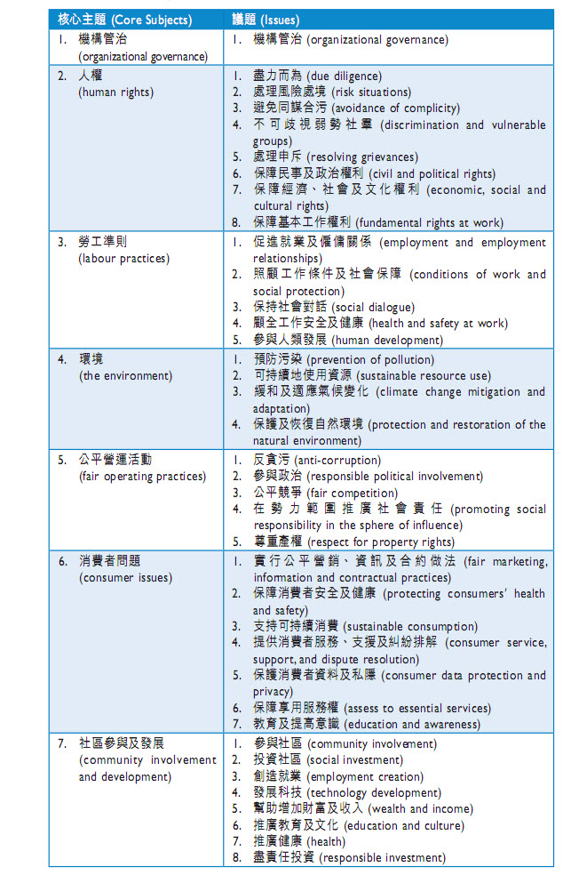

# ESG 披露制度有哪些

披露ESG信息时，全球各地的组织制定有不同的标准，各经济实体可自行选择使用。这里列出部分组织制定的披露制度、ESG标准等。

- 根据KPMG、GRI、UNEP和斯泰伦博什大学发布的《2016年可持续报告准则与政策的全球趋势》，截至2016年，全球已发布的ESG信息披露标准共有383个。
- 政府发布的标准最多，高达223个；金融监管部门69个；交易所44个；行业监管部门15个。
- 针对大型企业的标准达163个，其中52个针对非上市企业，111个针对上市企业；针对国有企业的有28个；针对公共事业单位的23个，针对中小企业的仅9个，针对所有企业的有155个。

## 国际组织

### GRI Standards

全球报告倡议组织(GRI)成立于1997年，是由美国的一个非政府组织“对环境负责的经济体联盟”(Coalition for Environmentally Responsible Economies，简称CERES)和联合国环境规划署(United Nations Environment Programme，简称UNEP)共同发起的，秘书处设在荷兰的阿姆斯特丹。

- 1997年到1998年间，CERES逐步形成为可持续发展信息的披露提供一个框架的想法，于是最先发起了“全球报告倡议”项目，并开始招募人员、筹集资金、建设网络。1999年，UNEP加入GRI成为共同的合作方，确保了全球报告倡议组织在全球平台上开展活动。

- 2000年，GRI发布了第一代《可持续发展报告指南》，其在全球的影响已经遍布南美、北美、大洋洲、欧洲、南亚和日本，50个机构在GRI报告指南的基础上发布他们的可持续发展报告。2001年，按照GRI管理委员会(Steering Committee)的建议，CERES的董事会决定将GRI剥离，成为一个独立机构。GRI开始起草关于合并成立法人组织和招募董事会成员的规则，并针对2000年版指南的使用者收集反馈信息，以便于修订。

- 2002年，GRI正式成为一个独立的国际组织，以UNEP官方合作中心的身份成为了联合国成员；GRI解散了管理委员会，正式任命临时董事会并选举主席，GRI的运营和资产正式从CERES分离开来，总部设在荷兰。同年，GRI第二代《可持续发展报告指南》2002年版本(简称G2)在南非约翰内斯堡的世界可持续发展峰会上正式发布。

- 2003年至2006年间，GRI相继完成一系列机构的任命，建立了自身独特的治理结构，并在荷兰的阿姆斯特丹设立办公室，成为永久性总部。

- 2006年10月5日，GRI在荷兰阿姆斯特丹召开大会，发布了第三代《可持续发展报告指南》(也称2006年版指南，G3)。

世界可持续发展工商理事会(WBCSD)于2002年1月发表了认可和支持GRI的公告，并承诺鼓励其成员积极支持GRI。联合国前秘书长安南、英国前首相布莱尔和OECD的“可持续发展与环境和多国企业指南工作室”都曾多次高度评价GRI及其《指南》。2002年，GRI与联合国前秘书长安南发起的“全球契约”(Global Compact)建立了合作关系。基于《指南》提供的报告在日本、美国和欧洲得到了一系列重要的非财务报告奖励，国际上一些著名媒体(如《华盛顿邮报》、《金融时报》等)、著名跨国公司(如杜邦公司、宝马公司、荷兰皇家壳牌集团等)都对GRI及其《指南》给予了高度评价。

- 2016年10月，GRI 发布**GRI Standards《**GRI标准》，已在2018年7月1日全面取代旧有版本G4。作为国际上广泛认可和引用的可持续发展报告框架，《GRI标准》包含“GRI 101基础”、“GRI 102一般披露”、“GRI 103管理方法”共3项通用准则，以及“GRI 200经济议题披露”、“GRI  300环境议题披露”与“GRI 400社会议题披露”等议题标准，为企业提供议题披露内容及方法。

目前，GRI 已经成为全世界应用最广的可持续发展报告框架。

- 2021年5月，GRI对行业标准草案开放公众意见，涵盖农业，水产养殖，渔业和煤炭。现已开始进行磋商，以收集对GRI部门计划下的两项拟议新标准的反馈，这些新标准将通过集中关注最重要的可持续性问题来提高部门内部的透明度。
- 除了目前（2021年）正在最终确定的《石油和天然气行业标准》外，GRI全球可持续发展标准委员会（GSSB）还宣布了以下方面的征求意见稿：
  - 在[**农业，水产养殖和渔业部门的标准**](https://www.globalreporting.org/standards/standards-development/sector-standard-project-for-agriculture-aquaculture-and-fishing/)，涵盖了生物多样性和自然生态系统的影响; 气候变化适应；动植物健康；食品安全与保障；经济包容性；和劳工标准。
  - 一个[**煤炭行业标准**](https://www.globalreporting.org/standards/standards-development/sector-standard-project-for-coal/)，解决企业如何应对低碳转型，同时突出对当地社区的影响; 环境风险管理；付款透明度；和所有权的披露。

### ISO 260000

ISO 26000是国际标准化组织(ISO)起草制定的社会责任指南(Guidance on Social Responsibility)的技术编号。

ISO 26000的每一稿都进行了不同程度的修订，有的针对相关术语的范围界定进行调整，有的针对社会责任定义的注释进行斟酌修正，但无论出于何种形式何种目的的修改，都不难得出结论，各利益相关方对于社会责任的准确完整定义各持己见，较难达成一致。

ISO 26000 的应用与GRI的相比要小得多，更多地是作为一种参考。

### CDP

- CDP 是一家总部位于伦敦的非政府国际组织，为公司与城市提供全球唯一的测量，披露，管理和分享重要环境信息的系统。CDP与其各作伙伴通过市场力量鼓励企业去披露他们对于环境和自然资源的影响，并使他们采取行动减少其产生的影响。
- CDP，前身为碳披露项目，是一家国际非营利性组织，为公司与城市、国家及地区提供全球唯一的测量，披露，管理和分享重要环境信息的系统。CDP与827个管理资产总额超过100万亿美元的机构投资者会员，89家供应链会员合作，鼓励企业去披露他们对于环境和自然资源的影响，并采取行动减少其产生的影响。目前，CDP拥有全球最大的关于气候变化，水和森林风险的信息数据库，并且把这些运用于战略性的商业投资和政策决定核心。 
- CDP每年向公司发放气候变化、水和森林问卷，一般是投资者为导向：即收到问卷的公司一般是投资者或采购人委托CDP进行征询的。
- CDP问卷关系到投资者、采购人对公司的认知。
- 没收到CDP问卷的公司也可以自主进行披露，只需缴纳一定的费用。

### SASB 可持续会计准则

- **Sustainability Accounting Standards Board (SASB)**成立于2011年，其主要使命在于开发可持续的会计准则；
- 可持续发展会计准则委员会（SASB）于2018年发布了可持续会计准则，涵盖了77个行业。
- [行业准则可以从这里下载](https://www.sasb.org/standards-overview/download-current-standards/)。

> SASB制定这些准则的初衷是为财务申报资料、可持续发展报告、年度报告以及公司网站发布内容提供强有力的支持。这套可持续会计准则可与其他可持续框架结合使用，它与“气候相关财务信息披露工作小组”(TCFD)的建议保持一致，为“全球报告倡议组织”（GRI）的相关工作提供了有益的补充。([link](https://news.esnai.com/2018/1110/182329.shtml))

2019年与[ESG的整合报告见这里](https://www.sasb.org/wp-content/uploads/2019/12/ESG-Integration-Insights-2019.pdf)。

### ISSB

- 2021年11月，第26届联合国气候变化大会（COP26）正在英国举行，世界领导人正齐聚格拉斯哥，共商解决气候变化这一关键和紧迫的问题。趁此重要时机，国际财务报告准则（IFRS）基金会官宣了国际可持续发展标准理事会（ISSB）的正式成立，旨在制定一个全面的高质量可持续发展披露标准的全球基准，以满足全球投资者关于气候和其他可持续发展事项的信息需求。会上，国际财务报告准则（IFRS）基金会官宣了国际可持续发展标准理事会（ISSB）的正式成立，旨在制定一个全面的高质量可持续发展披露标准的全球基准，以满足全球投资者关于气候和其他可持续发展事项的信息需求。新的 ISSB 将与国际会计准则委员会 （IASB） 并驾齐驱，两个委员会均由 IFRS 基金会受托人监督。IFRS 基金会表示，董事会将是独立的，并将密切合作，建立互补的标准，为投资者和其他资本提供者提供全面的信息。随着 ISSB 的成立，IFRS 基金会受托人主席 Erkki Liikanen 还宣布，领先的可持续发展报告标准组织CDSB和VRF将于2022年6月并入IFRS基金会。
- 从2020年9月30日IFRS基金会发布《关于可持续发展报告的咨询文件》以来，建立可持续发展标准理事会，通过该理事会与现有的报告倡议组织进行合作以建立全球一致的可持续信息披露标准的建议，得到了广泛的市场主体的赞同和期待。如今，国际可持续发展标准理事会正式成立，且基于现有报告标准的工作成果制定的气候披露和一般披露要求模板已经发布，这标志着建立全球一致可持续信息披露标准的事情正式落地实施，而且ISSB工作进展的速度之快可见一斑。鉴于对可持续信息需求的增加及其紧迫性，相信用不了多久，关于气候披露和一般披露要求的正式标准将会出台。

## 交易所

### 伦敦交易所ESG报告指南

在[伦敦交易所发布的 ESG报告指南](https://www.lseg.com/sites/default/files/content/images/Green_Finance/ESG/2018/February/LSEG_ESG_report_January_2018.pdf)中，并没有给出详细的主题、议题，而是让上市公司从众多国际组织发布的标准选择一个进行应用、披露。

### 纳斯达克ESG报告指南

2019年，[Nasdaq 发布](https://www.nasdaq.com/ESG-Guide)了 [ESG 报告指南2.0版](https://www.nasdaq.com/docs/2019/11/26/2019-ESG-Reporting-Guide.pdf)。对于其板块上市公司，纳斯达克并没有强制要求进行ESG信息的披露，而是完全的自愿（*This is a completely voluntary initiative*）

### 新加坡交易所可持续发展报告制度

其[制度规定](https://www.sgx.com/zh-hans/regulation/sustainability-reporting)：

- 遵守或解释

- 必须有董事会声明，即董事会要对ESG负责

  > 董事会应确认对企业具有重大意义的ESG因素，并确保对这些因素进行监测和管理。

- 上市公司可选择一个或多个框架进行披露：

  - [Sustainability Accounting Standards Board](http://www.sasb.org)
  - [Roundtable on Sustainable Palm Oil ](http://www.rspo.org/about)
  - [International Integrated Reporting Council](http://integratedreporting.org)
  - [Institutional Investors Group on Climate Change](http://www.iigcc.org) 
  - [Global Reporting Initiative](https://www.globalreporting.org) 
  - [Climate Disclosure Standards Board](http://www.cdsb.net) 
  - [CDP ](https://www.cdp.net/en)(前称为碳信息披露项目)
  - [Asset Owners Disclosure Project](http://aodproject.net) 

**时间表**

- 2016年新加坡交易所宣布自2018年起对新交所上市公司的年度可持续发展报告实行“不披露就解释”规定，要求公司披露其可持续发展实践。
- 2019年11月新加坡金融监管局宣布实施《绿色金融行动计划》，为银行、保险和资产管理部门制定环境风险管理指南。此外，新加坡银行业拟将客户ESG表现纳入其授信评估流程；保险业拟将ESG纳入投资和承保流程。

### 香港交易所

- 2012年发布《[ESG报告指引](https://www.hkex.com.hk/Listing/Rules-and-Guidance/Other-Resources/Listed-Issuers/Environmental-Social-and-Governance/ESG-Reporting-Guide-and-FAQs?sc_lang=zh-HK)》，作为上市公司自愿性披露建议
- 2018年9月发布《绿色金融战略框架》，其中主要任务包括加强上市公司对环境信息的披露（特别是与气候有关的披露）。
- 2016年起将部分建议上升至半强制披露层面，实施”不披露就解释”规则。
- 2019年5月发布了《指引》修订建议的咨询文件，同年12月确定新版《指引》内容，进一步扩大强制披露的范围，将披露建议全面调整为“**不披露就解释**”，持续提升对在港上市公司的ESG信息披露要求。
- 2021年11月5日，香港联交所发布了供上市发行人参考的气候信息披露指引，以及《有关2020/2021年IPO申请人企业管治及ESG常规情况的报告》。《气候信息披露指引》是一份指导性文件，目标对象为尚未就气候相关议题建立实质内部专门知识的公司，旨在为促进上市公司遵守气候相关财务信息披露工作小组（TCFD）的建议提供实用指引，并按照相关建议做出汇报。同时，香港绿色和可持续金融跨机构督导小组也已宣布，拟于2025年或之前强制实施符合TCFD建议的气候相关信息披露。

## 政府层面

### 欧盟：公司治理框架绿皮书

2011年4月，欧盟发布了 [GREEN PAPER The EU corporate governance framework](https://op.europa.eu/en/publication-detail/-/publication/3eed7997-d40b-4984-8080-31d7c4e91fb2/language-en)。

> 认为机构投资者在当前的金融市场扮演着支配性的角色，但也对其短期思维和行为提出了批评。绿皮书指出，长期的和适当的股东行动是有效公司治理框架的关键，应当引入新的公司治理举措推动机构投资者介入到对公司长期战略的监督和评价上；
>
> 应当致力于扩展对上市公司股份持有状况的披露要求，此类规则将会推动公司与投资者之间的有效对话，透明度的增加也有助于董事会免于被股东过度介入。
>
> 绿皮书也充分关注了小股东利益保护问题，指出股权与控制权的高度集中更容易引发相关人借助关联交易等手段进行机会主义的利益盘剥。尽管欧洲的法律与规章已经包含了大量的旨在限制控制股东从公司攫取利益的披露机制，但欧委会进一步考虑通过赋予小股东提名任命董事会或监事会成员、以及采用独立建议来协助小股东更好理解公司财务报告等方式来加强小股东保护。
>
> 欧委会在2012年12月12日的交流会上，发布了“行动计划：欧洲公司法和公司治理——面向更富行动力股东和可持续公司的现代法律框架”，欧委会宣布在公司治理领域的一系列行动计划，特别是要致力于鼓励长期股东行动以及增强公司与投资者之间的透明度。
>
> *汪青松 西南政法大学民商法学院*

### 韩国：公司治理最佳实践准则

2003年：

> “为了在公司内部建立有效的治理结构，金融机构和信贷评估机构在评估公司信誉等级时，应当将公司治理结构的质量和有效性包括在内。”

